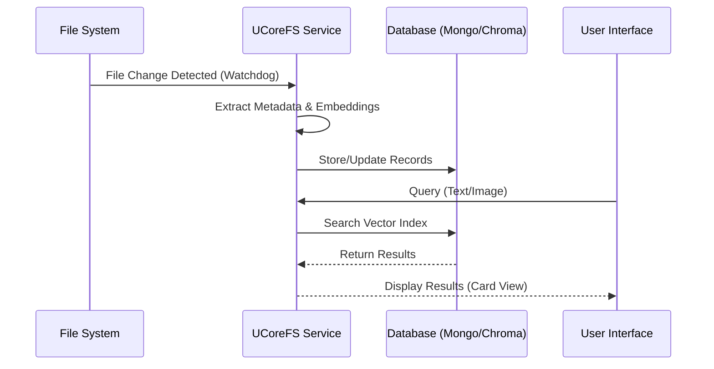

# System Architecture

## Overview

USCore follows a modular architecture built on top of a strong **Foundation** layer. The application is composed of loosely coupled services managed by a global Service Locator.

```mermaid
graph TD
    User[User] --> UI[UI Layer (MVVM)]
    UI --> Core[Core Foundation]
    
    subgraph Foundation
        Core --> SL[Service Locator]
        Core --> Config[Configuration]
        Core --> Events[Event System]
    end
    
    subgraph Modules
        Core --> UCoreFS[UCoreFS (Data & AI)]
        Core --> NodeGraph[NodeGraph (Visual Scripting)]
        Core --> Plugins[Plugin System]
    end
    
    UCoreFS --> DB[(MongoDB / ChromaDB)]
```

## Directory Structure

The project is organized as follows:

- **`templates/foundation/src/core`**: The heart of the framework. Contains the Service Locator, Base Service classes, Event Bus, and Configuration logic.
- **`templates/foundation/src/ui`**: Reusable UI components, Docking system, and MVVM base classes (`BindableProperty`).
- **`templates/foundation/src/ucorefs`**: A specialized filesystem database that combines file tracking with AI vector embeddings.
- **`templates/foundation/src/nodegraph`**: A visual node editor engine similar to Unreal Engine Blueprints.
- **`samples/`**: Example applications demonstrating how to use the framework (e.g., `uexplorer`, `node_editor`).

## Core Patterns

### Service Locator
Everything is a service. The `ServiceLocator` (`src.core.locator`) is the central registry. Services are registered at startup and injected where needed. This allows for easy testing and swapping of implementations.

### Application Builder
The `ApplicationBuilder` provides a fluent API to bootstrap the application, register services, and configure the main window.

### MVVM (Model-View-ViewModel)
The UI relies heavily on MVVM. `BindableProperty` allows for reactive UI updates without tight coupling between logic and widgets.

## Data Flow

The following diagram illustrates how data moves through the system, from the file system to the UI.



