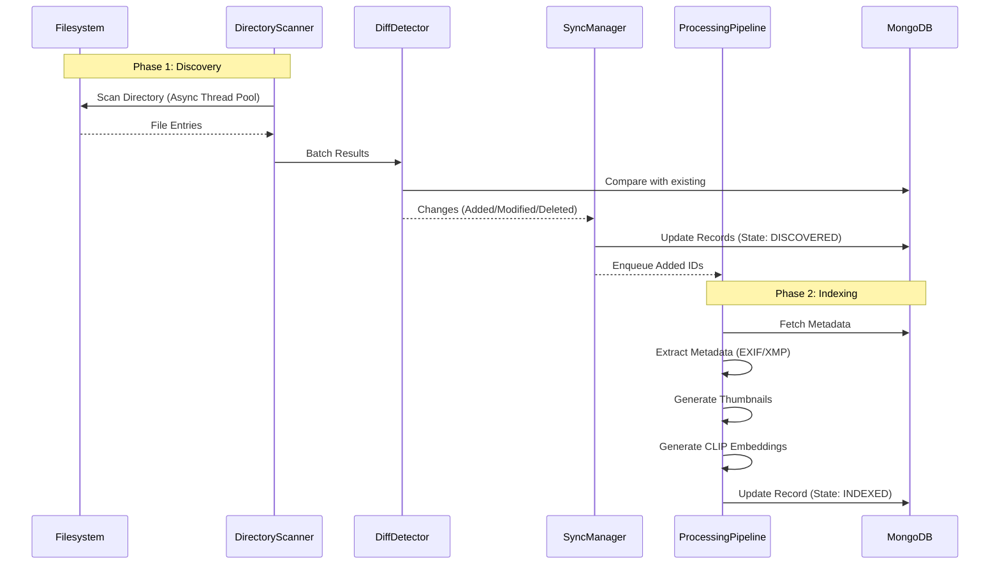
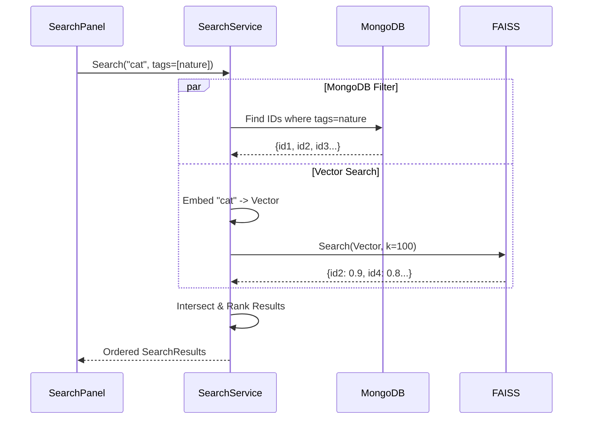

# Data Flow Diagrams

## 1. Discovery & Indexing Flow

How files move from the filesystem to the database and search index.

## 2. Search & Retrieval Flow

How user queries are processed and results are ranked.

