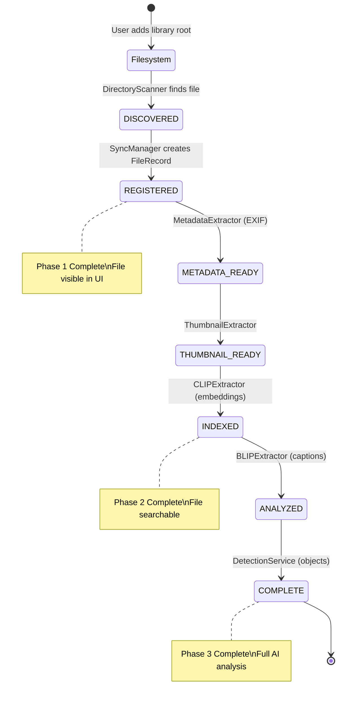

# Indexer Pipeline Architecture

**Document Version**: 1.0  
**Last Updated**: 2025-12-28  
**Research Depth**: Deep Code Analysis  
**Related**: [Tag/Directory/Album Systems](file:///d:/github/USCore/docs/tag_directory_album_systems.md)

## Table of Contents

1. [Overview](#overview)
2. [Pipeline Phases](#pipeline-phases)
3. [Core Components](#core-components)
4. [Data Flow & State Machine](#data-flow--state-machine)
5. [System Interactions](#system-interactions)
6. [UExplorer Integration](#uexplorer-integration)
7. [Performance & Optimization](#performance--optimization)
8. [Configuration](#configuration)

---

## Overview

The **Indexer Pipeline** is the backbone of USCore's file management system. It transforms raw filesystem data into a rich, searchable database with AI-powered metadata, embeddings, and relationships.

### Purpose

- **Discover** files from filesystem
- **Extract** metadata (EXIF, XMP, thumbnails)
- **Analyze** content using AI (CLIP embeddings, BLIP captions, object detection)
- **Index** for fast search and similarity matching
- **Maintain** consistency between filesystem and database

### Architecture Philosophy

```
Filesystem → Discovery → Processing → AI Analysis → Search Index
    ↓           ↓            ↓            ↓             ↓
  Raw Data → Structure → Metadata → Semantics → Insights
```

**Key Principles**:
1. **Progressive Loading**: Files become usable immediately, enrich over time
2. **Batch Processing**: Handle millions of files without memory issues
3. **Fault Tolerance**: Resume interrupted processing automatically
4. **Event-Driven**: Reactive to filesystem changes
5. **Extensible**: Plugin architecture for new extractors

---

## Pipeline Phases

The indexer operates in **3 distinct phases**, each with different batch sizes and processing characteristics:

### Phase 1: Discovery (Batch: 200 items)

**Purpose**: Scan filesystem and detect changes

**Components**:
- `DirectoryScanner`: Walk directory trees
- `DiffDetector`: Compare filesystem vs database
- `SyncManager`: Apply changes atomically

**Output**: `FileRecord` with `processing_state = REGISTERED`

**Speed**: ~10,000 files/second (depends on disk I/O)

### Phase 2: Metadata & Basic AI (Batch: 20 files)

**Purpose**: Extract metadata and generate basic embeddings

**Extractors** (in priority order):
1. **ThumbnailExtractor** (priority: 100)
   - Generates multiple thumbnail sizes
   - State → `THUMBNAIL_READY`
   
2. **MetadataExtractor** (priority: 90)
   - Extracts EXIF data (camera, GPS, dates)
   - State → `METADATA_READY`
   
3. **XMPExtractor** (priority: 85)
   - Parses XMP sidecar files
   - Extracts hierarchical tags (e.g., `Lightroom/Keywords`)
   
4. **CLIPExtractor** (priority: 80, optional)
   - Generates 512-dim image embeddings
   - Stores in FAISS + MongoDB
   - State → `INDEXED`

**Output**: Searchable files with thumbnails and metadata

**Speed**: ~5-10 files/second (depends on AI model and GPU)

### Phase 3: Advanced AI (Batch: 1 file)

**Purpose**: Heavy AI analysis (optional, on-demand)

**Extractors**:
1. **BLIPExtractor**
   - Generates natural langu age captions
   - Example: "A cat sitting on a windowsill"
   
2. **GroundingDINOExtractor**
   - Zero-shot object detection
   - Creates `DetectionInstance` records with bounding boxes
   
3. **WDTaggerExtractor**
   - Anime/illustration auto-tagging
   - Tags under `auto/wd_tag/` hierarchy
   
4. **DetectionService** (YOLO/MTCNN)
   - Face detection, object detection
   - Configurable backends

**Output**: `FileRecord` with `processing_state = COMPLETE`

**Speed**: ~0.5-2 files/second (very heavy)

---

## Core Components

### 1. DiscoveryService

**Location**: [`src/ucorefs/discovery/service.py`](file:///d:/github/USCore/src/ucorefs/discovery/service.py)

**Responsibilities**:
- Orchestrate filesystem scanning
- Coordinate `DirectoryScanner`, `DiffDetector`, `SyncManager`
- Publish events for UI updates
- Integrate with `TaskSystem` for background execution

**Key Methods**:

```python
class DiscoveryService(BaseSystem):
    async def scan_root(
        root_id: ObjectId,
        background: bool = True
    ) -> Optional[str]:
        """
        Scan a library root for changes.
        
        Returns:
            Task ID if background, None if immediate
        """
        
    async def _scan_root_impl(root_id: ObjectId) -> dict:
        """
        Implementation: scan → diff → sync → queue Phase 2
        
        Returns:
            Statistics: {files_added, dirs_added, files_modified, ...}
        """
```

**Scan Flow**:

```
1. Load library root (DirectoryRecord with is_root=True)
   ↓
2. Batch scan filesystem (DirectoryScanner)
   for batch in scanner.scan_directory(...):
       ↓
3. Detect changes (DiffDetector)
   diff = await diff_detector.detect_changes(batch)
       ↓
4. Apply changes (SyncManager)
   stats = await sync_manager.apply_changes(diff, root_id)
       ↓
5. Queue Phase 2 (ProcessingPipeline)
   added_ids = stats["added_file_ids"]
   await processing_pipeline.enqueue_phase2(added_ids)
       ↓
6. Publish event (CommandBus)
   await bus.publish("filesystem.updated", stats)
```

### 2. DirectoryScanner

**Location**: [`src/ucorefs/discovery/scanner.py`](file:///d:/github/USCore/src/ucorefs/discovery/scanner.py)

**Responsibilities**:
- Walk filesystem using `os.scandir()`
- Respect `watch_extensions` and `blacklist_paths`
- Yield results in batches for memory efficiency

**Key Features**:

```python
class DirectoryScanner:
    def scan_directory(
        root_path: str,
        watch_extensions: List[str],
        blacklist_paths: List[str],
        recursive: bool = True
    ) -> Iterator[List[ScanResult]]:
        """
        Yields batches of ScanResult.
        
        Batch size: 1000 items (configurable)
        """
    
    async def scan_directory_async(...):
        """
        Async version that runs blocking I/O in thread pool.
        Prevents UI freezing during large scans.
        """
```

**ScanResult** structure:

```python
@dataclass
class ScanResult:
    path: str                # Full filesystem path
    is_directory: bool       # File or directory
    size: int                # Size in bytes
    modified_time: float     # OS mtime timestamp
    extension: str           # File extension (no dot)
```

### 3. DiffDetector

**Location**: [`src/ucorefs/discovery/diff.py`](file:///d:/github/USCore/src/ucorefs/discovery/diff.py)

**Responsibilities**:
- Compare scan results with database state
- Detect additions, modifications, deletions
- Support incremental mode (skip deletions during batches)

**Algorithm**:

```python
async def detect_changes(
    scan_results: List[ScanResult],
    root_path: str,
    incremental: bool = False
) -> DiffResult:
    """
    Incremental=True: Only detect adds/mods (per batch)
    Incremental=False: Also detect deletions (final pass)
    """
    
    # Build path sets
    scanned_paths = {r.path for r in scan_results}
    scanned_files = {r.path: r for r in scan_results if not r.is_directory}
    scanned_dirs = {r.path: r for r in scan_results if r.is_directory}
    
    # Query DB for existing records
    existing_files = await FileRecord.find({"path": {"$in": list(scanned_paths)}})
    existing_dirs = await DirectoryRecord.find({"path": {"$in": list(scanned_paths)}})
    
    # Detect additions
    for path, scan_result in scanned_files.items():
        if path not in existing_file_paths:
            diff.added_files.append(scan_result)
    
    # Detect modifications (size or mtime changed)
    for path in scanned_files.keys() & existing_file_paths.keys():
        if is_modified(existing, scanned):
            diff.modified_files.append((existing, scanned))
    
    # Detect deletions (only if not incremental)
    if not incremental:
        all_db_files = await FileRecord.find({"path": {"$regex": f"^{root_path}"}})
        for db_file in all_db_files:
            if db_file.path not in scanned_paths:
                diff.deleted_files.append(db_file)
    
    return diff
```

**DiffResult** structure:

```python
class DiffResult:
    added_files: List[ScanResult]
    added_dirs: List[ScanResult]
    modified_files: List[Tuple[FileRecord, ScanResult]]
    deleted_files: List[FileRecord]
    deleted_dirs: List[DirectoryRecord]
```

### 4. SyncManager

**Location**: [`src/ucorefs/discovery/sync.py`](file:///d:/github/USCore/src/ucorefs/discovery/sync.py)

**Responsibilities**:
- Apply `DiffResult` changes to database
- Maintain hierarchy (parent_id, root_id)
- Update statistics (file_count, total_size)

**Apply Changes Flow**:

```python
async def apply_changes(
    diff: DiffResult,
    root_id: str
) -> dict:
    """
    Apply all detected changes atomically.
    
    Returns:
        {
            files_added: int,
            dirs_added: int,
            files_modified: int,
            files_deleted: int,
            dirs_deleted: int,
            added_file_ids: List[ObjectId]  # For Phase 2 queueing
        }
    """
    
    # 1. Delete files (children before parents)
    for file in diff.deleted_files:
        await file.delete()
    
    # 2. Delete directories (children before parents, sorted by depth)
    for directory in sorted(diff.deleted_dirs, key=depth, reverse=True):
        await directory.delete()
    
    # 3. Add directories (parents before children, sorted by depth)
    for directory in sorted(diff.added_dirs, key=depth):
        parent = await DirectoryRecord.find_one({"path": parent_path})
        await fs_service.upsert_directory(
            path=directory.path,
            name=directory.name,
            parent_id=parent._id if parent else None,
            root_id=root_id
        )
    
    # 4. Add files
    added_ids = []
    for file in diff.added_files:
        parent = await DirectoryRecord.find_one({"path": parent_path})
        file_record = await fs_service.upsert_file(
            path=file.path,
            name=file.name,
            parent_id=parent._id if parent else None,
            root_id=root_id,
            size_bytes=file.size,
            modified_at=datetime.fromtimestamp(file.modified_time),
            processing_state=ProcessingState.REGISTERED  # ← Initial state
        )
        added_ids.append(file_record._id)
    
    # 5. Update modified files
    for existing, scan_result in diff.modified_files:
        existing.size_bytes = scan_result.size
        existing.modified_at = datetime.fromtimestamp(scan_result.modified_time)
        await existing.save()
    
    return {
        "files_added": len(diff.added_files),
        "added_file_ids": added_ids  # ← Critical for Phase 2
    }
```

### 5. ProcessingPipeline

**Location**: [`src/ucorefs/processing/pipeline.py`](file:///d:/github/USCore/src/ucorefs/processing/pipeline.py)

**Responsibilities**:
- Queue Phase 2/3 processing tasks
- Invoke extractors via `ExtractorRegistry`
- Track pending work to avoid duplicates
- Publish progress events

**Key Methods**:

```python
class ProcessingPipeline(BaseSystem):
    PHASE2_BATCH_SIZE = 20
    PHASE3_BATCH_SIZE = 1
    
    async def enqueue_phase2(
        file_ids: List[ObjectId],
        force: bool = False
    ) -> Optional[str]:
        """
        Queue Phase 2 processing (thumbnails, metadata, basic AI).
        
        Args:
            file_ids: Files to process
            force: Bypass pending check (for reprocessing)
            
        Returns:
            Task ID from TaskSystem
        """
        # Filter already pending (unless forced)
        new_ids = [fid for fid in file_ids if str(fid) not in self._phase2_pending]
        
        # Mark as pending
        for fid in new_ids:
            self._phase2_pending.add(str(fid))
        
        # Submit in batches
        for i in range(0, len(new_ids), self.PHASE2_BATCH_SIZE):
            batch = new_ids[i:i + self.PHASE2_BATCH_SIZE]
            task_id = await self.task_system.submit(
                "process_phase2_batch",
                f"Phase 2: Process {len(batch)} files",
                ",".join(str(fid) for fid in batch)
            )
        
        return task_id
    
    async def _handle_phase2_batch(file_ids_str: str) -> dict:
        """
        Task handler: Process a batch of files through Phase 2.
        """
        file_ids = [ObjectId(fid) for fid in file_ids_str.split(",")]
        
        # Load files from DB
        files = [await FileRecord.get(fid) for fid in file_ids]
        
        # Get Phase 2 extractors from registry
        extractors = ExtractorRegistry.get_for_phase(2, locator=self.locator)
        
        # Run each extractor
        for extractor in extractors:
            processable = [f for f in files if extractor.can_process(f)]
            if processable:
                results = await extractor.process(processable)
                # results = {file_id: True/False}
        
        # Remove from pending
        for fid in file_ids:
            self._phase2_pending.discard(str(fid))
        
        # Publish progress event
        await self._publish_progress("phase2.complete", results)
        
        return results
```

**Event Subscriptions**:

```python
async def initialize(self):
    # Subscribe to file events for auto-processing
    bus = self.locator.get_system(CommandBus)
    bus.subscribe("file.created", self._on_file_created)
    bus.subscribe("file.modified", self._on_file_modified)

async def _on_file_created(event: dict):
    """Auto-queue new files for processing"""
    file_id = event["file_id"]
    await self.enqueue_phase2([file_id])
```

### 6. ExtractorRegistry

**Location**: [`src/ucorefs/extractors/registry.py`](file:///d:/github/USCore/src/ucorefs/extractors/registry.py)

**Responsibilities**: 
- Central registry for all extractors
- Plugin architecture (Open/Closed Principle)
- Dependency injection via ServiceLocator

**Plugin Pattern**:

```python
class ExtractorRegistry:
    _extractors: Dict[int, List[Type[Extractor]]] = {
        2: [],  # Phase 2
        3: []   # Phase 3
    }
    _instances: Dict[str, Extractor] = {}  # Cached instances
    
    @classmethod
    def register(cls, extractor_cls: Type[Extractor]):
        """Register an extractor (called at app startup)"""
        phase = extractor_cls.phase  # 2 or 3
        cls._extractors[phase].append(extractor_cls)
    
    @classmethod
    def get_for_phase(cls, phase: int, locator, config: Dict) -> List[Extractor]:
        """Get all extractors for a phase, sorted by priority"""
        instances = []
        for extractor_cls in cls._extractors[phase]:
            name = extractor_cls.name
            if name not in cls._instances:
                cls._instances[name] = extractor_cls(locator=locator, config=config.get(name, {}))
            instances.append(cls._instances[name])
        
        # Sort by priority (higher first)
        return sorted(instances, key=lambda e: e.priority, reverse=True)
```

**Extractor Base Class**:

```python
class Extractor(ABC):
    phase: int = 2           # Which pipeline phase
    priority: int = 50       # Execution order
    name: str = "base"       # Unique identifier
    
    @abstractmethod
    async def process(self, files: List[FileRecord]) -> Dict[ObjectId, bool]:
        """
        Process a batch of files.
        
        Returns:
            {file_id: success_bool}
        """
        pass
    
    @abstractmethod
    def can_process(self, file: FileRecord) -> bool:
        """Check if this extractor can handle the file"""
        pass
```

**Example: CLIPExtractor**:

```python
class CLIPExtractor(Extractor):
    phase = 2
    priority = 80
    name = "clip"
    
    def __init__(self, locator, config):
        self.model = load_clip_model()  # CLIP ViT-B/32
        self.vector_service = locator.get_system(VectorService)
    
    def can_process(self, file: FileRecord) -> bool:
        return file.extension.lower() in ['.jpg', '.png', '.webp']
    
    async def process(self, files: List[FileRecord]) -> Dict[ObjectId, bool]:
        results = {}
        
        # Batch encode images
        images = [load_image(f.path) for f in files]
        embeddings = self.model.encode_image(images)  # Shape: (N, 512)
        
        # Store in vector index
        for file, embedding in zip(files, embeddings):
            success = await self.vector_service.upsert(
                collection="clip",
                file_id=file._id,
                vector=embedding.tolist()
            )
            results[file._id] = success
            
            # Update file state
            if success:
                file.processing_state = max(file.processing_state, ProcessingState.INDEXED)
                await file.save()
        
        return results
```

### 7. VectorService & FAISSIndexService

**Location**:
- [`src/ucorefs/vectors/service.py`](file:///d:/github/USCore/src/ucorefs/vectors/service.py)
- [`src/ucorefs/vectors/faiss_service.py`](file:///d:/github/USCore/src/ucorefs/vectors/faiss_service.py)

**Architecture**:

```
┌─────────────────────────────────────────────────┐
│           VectorService (Facade)                │
│  - Simplified API for extractors                │
│  - Deprecated in favor of SearchService         │
└──────────────────┬──────────────────────────────┘
                   │
                   ↓
┌─────────────────────────────────────────────────┐
│        FAISSIndexService (In-Memory)            │
│  - Separate indexes per provider                │
│  - Cosine similarity search                     │
│  - Loaded from MongoDB on startup               │
└──────────────────┬──────────────────────────────┘
                   │
                   ↓
┌─────────────────────────────────────────────────┐
│      MongoDB `embeddings` Collection            │
│  - Persistent storage                           │
│  - Schema: {provider, file_id, vector}          │
└─────────────────────────────────────────────────┘
```

**FAISSIndexService**:

```python
class FAISSIndexService(BaseSystem):
    async def initialize(self):
        """Load all embeddings from MongoDB into FAISS"""
        self._indexes = {}  # {provider: faiss.IndexFlatIP}
        
        for provider in PROVIDERS:  # clip, blip, mobilenet, thumb
            embeddings = await EmbeddingRecord.find({"provider": provider})
            
            if embeddings:
                vectors = np.array([e.vector for e in embeddings])
                file_ids = [e.file_id for e in embeddings]
                
                # Create FAISS index (Inner Product = Cosine for normalized vectors)
                index = faiss.IndexFlatIP(vectors.shape[1])  # dimension
                index.add(vectors)
                
                self._indexes[provider] = {
                    "index": index,
                    "file_ids": file_ids  # Maintain file_id mapping
                }
    
    async def search(
        self,
        collection: str,
        query_vector: List[float],
        k: int = 10,
        file_ids: Optional[List[ObjectId]] = None
    ) -> List[Tuple[ObjectId, float]]:
        """
        Search for similar vectors.
        
        Args:
            collection: Provider name (clip, blip, etc.)
            query_vector: Query embedding
            k: Number of results
            file_ids: Optional pre-filter (from MongoDB filters)
            
        Returns:
            [(file_id, score), ...]
        """
        index_data = self._indexes.get(collection)
        if not index_data:
            return []
        
        # Normalize query vector
        query = np.array(query_vector, dtype=np.float32)
        query /= np.linalg.norm(query)
        
        # FAISS search
        scores, indices = index_data["index"].search(query.reshape(1, -1), k)
        
        # Map indices to file_ids
        results = []
        for idx, score in zip(indices[0], scores[0]):
            file_id = index_data["file_ids"][idx]
            
            # Apply filter if provided
            if file_ids is None or file_id in file_ids:
                results.append((file_id, float(score)))
        
        return results
```

### 8. SearchService (Unified Search)

**Location**: [`src/ucorefs/search/service.py`](file:///d:/github/USCore/src/ucorefs/search/service.py)

**Purpose**: Single entry point for all search operations

**Architecture**:

```python
@dataclass
class SearchQuery:
    text: Optional[str] = None                  # Text search
    filters: Dict[str, Any] = field(default_factory=dict)  # MongoDB filters
    vector_search: bool = False                 # Enable CLIP/BLIP search
    vector_provider: str = "clip"               # clip, blip, mobilenet
    vector_query: Optional[List[float]] = None  # Explicit vector
    limit: int = 100
    offset: int = 0
    sort_by: str = "score"
    sort_desc: bool = True


 class SearchService(BaseSystem):
    async def search(self, query: SearchQuery) -> List[SearchResult]:
        """
        Execute unified search combining MongoDB and vector search.
        
        Flow:
        1. Apply MongoDB filters
        2. Apply vector search (if enabled)
        3. Merge and rank results
        """
        
        # Step 1: MongoDB Filter Stage
        mongo_filter = self._build_mongo_filter(query)
        
        if query.vector_search:
            # Hybrid search: MongoDB + Vector
            
            # 1a. Get filtered file IDs from MongoDB
            filtered_files = await FileRecord.find(mongo_filter, limit=query.limit * 10)
            filtered_ids = [str(f._id) for f in filtered_files]
            
            # 1b. Vector search within filtered set
            if query.vector_query:
                vector = query.vector_query
            elif query.text:
                vector = await self._get_text_embedding(query.text, query.vector_provider)
            else:
                vector = None
            
            if vector:
                vector_results = await self._vector_search(query, filtered_ids)
                return vector_results[:query.limit]
        
        else:
            # Pure MongoDB search
            files = await FileRecord.find(
                mongo_filter,
                skip=query.offset,
                limit=query.limit,
                sort=[(query.sort_by, -1 if query.sort_desc else 1)]
            )
            return [SearchResult(file_id=f._id, score=1.0) for f in files]
```

**Filter Building**:

```python
def _build_mongo_filter(self, query: SearchQuery) -> Dict[str, Any]:
    """Build MongoDB filter from SearchQuery"""
    filter_dict = dict(query.filters)  # Copy base filters
    
    # Text search (regex on name, description, tags)
    if query.text:
        filter_dict["$or"] = [
            {"name": {"$regex": query.text, "$options": "i"}},
            {"ai_description": {"$regex": query.text, "$options": "i"}},
            {"tags": {"$regex": query.text, "$options": "i"}}
        ]
    
    return filter_dict
```

---

## Data Flow & State Machine

### Complete Indexer Flow Diagram



### State Transitions Table

| From State | To State | Trigger | Component |
|------------|----------|---------|-----------|
| `DISCOVERED` | `REGISTERED` | File inserted to DB | SyncManager |
| `REGISTERED` | `METADATA_READY` | EXIF extracted | MetadataExtractor |
| `METADATA_READY` | `THUMBNAIL_READY` | Thumbnails generated | ThumbnailExtractor |
| `THUMBNAIL_READY` | `INDEXED` | Embeddings stored | CLIPExtractor |
| `INDEXED` | `ANALYZED` | AI analysis complete | BLIPExtractor |
| `ANALYZED` | `COMPLETE` | Detections created | DetectionService |

### Processing State Enum

**Location**: [`src/ucorefs/models/base.py`](file:///d:/github/USCore/src/ucorefs/models/base.py)

```python
class ProcessingState(IntEnum):
    """
    File processing stage for progressive loading.
    
    Files progress through states as background processing completes.
    """
    DISCOVERED = 0       # Just found on filesystem (not yet in DB)
    REGISTERED = 10      # Path, name, size stored in DB
    METADATA_READY = 20  # EXIF, XMP extracted
    THUMBNAIL_READY = 30 # Thumbnails generated
    INDEXED = 40         # Embeddings stored, searchable via vector
    ANALYZED = 50        # AI descriptions, tags generated
    COMPLETE = 100       # All processing finished

    # Composite States (for querying)
    AI_READY = INDEXED   # Minimum state for AI search
```

**Usage in Queries**:

```python
# Find files ready for Phase 3
phase3_candidates = await FileRecord.find({
    "processing_state": {"$gte": ProcessingState.INDEXED, "$lt": ProcessingState.COMPLETE}
})

# Find files missing thumbnails
pending = await FileRecord.find({
    "processing_state": {"$lt": ProcessingState.THUMBNAIL_READY}
})
```

---

## System Interactions

### Interaction Map

```
┌─────────────────────────────────────────────────────────────┐
│                      USER ACTION                            │
│              (Add Library Root / Scan)                       │
└───────────────────────┬─────────────────────────────────────┘
                        │
                        ↓
        ┌───────────────────────────────┐
        │   DiscoveryService            │
        │  ┌─────────────────────────┐  │
        │  │ 1. DirectoryScanner     │  │──→ OS Filesystem (os.scandir)
        │  │ 2. DiffDetector         │  │←── Batch of ScanResults
        │  │ 3. SyncManager          │  │──→ MongoDB (upserts)
        │  └─────────────────────────┘  │
        └───────────┬───────────────────┘
                    │ (auto-queue)
                    ↓
        ┌───────────────────────────────┐
        │  ProcessingPipeline           │
        │  ┌─────────────────────────┐  │
        │  │ Phase 2 Task Queue      │  │
        │  │ (batch size: 20)        │  │
        │  └─────────┬───────────────┘  │
        │            │                   │
        │            ↓                   │
        │  ┌─────────────────────────┐  │
        │  │ ExtractorRegistry       │  │
        │  │ - ThumbnailExtractor    │  │──→ Generate thumbnails
        │  │ - MetadataExtractor     │  │──→ Extract EXIF
        │  │ - CLIPExtractor         │  │──→ Generate embeddings
        │  └─────────┬───────────────┘  │
        │            │                   │
        └────────────┼───────────────────┘
                     │
                     ↓
        ┌───────────────────────────────┐
        │  VectorService                │
        │  ┌─────────────────────────┐  │
        │  │ FAISSIndexService       │  │──→ In-memory FAISS indexes
        │  └─────────┬───────────────┘  │
        │            │                   │
        │            ↓                   │
        │  ┌─────────────────────────┐  │
        │  │ EmbeddingRecord         │  │──→ MongoDB persistence
        │  └─────────────────────────┘  │
        └───────────────────────────────┘
                     │
                     ↓
        ┌───────────────────────────────┐
        │  SearchService                │
        │  ┌─────────────────────────┐  │
        │  │ 1. MongoDB Filters      │  │──→ Tag, album, type filters
        │  │ 2. Vector Search        │  │──→ FAISS similarity
        │  │ 3. Merge & Rank         │  │──→ Unified results
        │  └─────────────────────────┘  │
        └───────────┬───────────────────┘
                    │
                    ↓
        ┌───────────────────────────────┐
        │        UI (UExplorer)         │
        │  - FilePaneWidget             │
        │  - MetadataPanel              │
        │  - BackgroundTasksPanel       │
        └───────────────────────────────┘
```

### Event Flow (Publish/Subscribe)

**CommandBus Events**:

| Event Name | Publisher | Subscribers | Payload |
|------------|-----------|-------------|---------|
| `filesystem.updated` | DiscoveryService | UI panels | `{root_id, stats}` |
| `file.created` | SyncManager | ProcessingPipeline | `{file_id}` |
| `file.modified` | SyncManager | ProcessingPipeline | `{file_id}` |
| `processing.phase2.complete` | ProcessingPipeline | UI (BackgroundPanel) | `{processed, errors, by_extractor}` |
| `processing.phase3.complete` | ProcessingPipeline | UI (BackgroundPanel) | `{file_id, processed, detections}` |

**Example: File Creation Flow**:

```
1. SyncManager creates FileRecord
   ↓
2. bus.publish("file.created", {file_id: ...})
   ↓
3. ProcessingPipeline._on_file_created() receives event
   ↓
4. await enqueue_phase2([file_id])
   ↓
5. TaskSystem schedules "process_phase2_batch" task
   ↓
6. _handle_phase2_batch() runs extractors
   ↓
7. bus.publish("processing.phase2.complete", results)
   ↓
8. UI updates progress bar
```

### Dependency Injection via ServiceLocator

**Registration Order** (critical!):

```python
# In samples/uexplorer/main.py
builder = (
    ApplicationBuilder("UExplorer", config_path)
    .with_default_systems()  # Config, TaskSystem, CommandBus
    .add_system(FSService)             # 1. Filesystem operations
    .add_system(ProcessingPipeline)    # 2. Before Discovery (dependency)
    .add_system(DiscoveryService)      # 3. Uses ProcessingPipeline
    .add_system(ThumbnailService)      # 4. Standalone
    .add_system(FAISSIndexService)     # 5. Before VectorService
    .add_system(VectorService)         # 6. Uses FAISSIndexService
    .add_system(SearchService)         # 7. Uses Vector + FS services
    # ... more services
)
```

**Why order matters**:
- `ProcessingPipeline` must be registered before `DiscoveryService` so Discovery can auto-queue Phase 2
- `FAISSIndexService` before `VectorService` for dependency injection
- `SearchService` last as it depends on both Vector and FS services

**Accessing Services** (in extractors, UI, etc.):

```python
# In CLIPExtractor
def __init__(self, locator, config):
    self.vector_service = locator.get_system(VectorService)
    self.fs_service = locator.get_system(FSService)

# In UI panels
class MetadataPanel:
    def __init__(self, locator):
        self.fs_service = locator.get_system(FSService)
```

---

## UExplorer Integration

### How UExplorer Uses the Indexer

**Entry Point**: [`samples/uexplorer/main.py`](file:///d:/github/USCore/samples/uexplorer/main.py)

**System Registration**:

```python
def main():
    config_path = Path(__file__).parent / "config.json"
    
    builder = (
        ApplicationBuilder("UExplorer", str(config_path))
        .with_default_systems()         # Config, Events, Tasks
        .with_logging(True)            # Loguru setup
        .add_system(SessionState)      # UI persistence
        .add_system(NavigationService) # Smart selection routing
        
        # Core UCoreFS Systems (Indexer Pipeline)
        .add_system(FSService)
        .add_system(MaintenanceService)  # Count consistency
        .add_system(ProcessingPipeline)  # ← Phase 2/3 orchestration
        .add_system(DiscoveryService)    # ← Phase 1 orchestration
        .add_system(ThumbnailService)
        .add_system(FAISSIndexService)
        .add_system(VectorService)
        .add_system(SearchService)
        
        # Additional Services
        .add_system(SimilarityService)   # Auto-relation creation
        .add_system(LLMService)          # Batch descriptions
        .add_system(RelationService)
        .add_system(TagManager)
        .add_system(AlbumManager)
        .add_system(RulesEngine)
        .add_system(DetectionService)
        .add_system(WDTaggerService)
        .add_system(AnnotationService)
    )
    
    # Run with Foundation's helper
    run_app(MainWindow, MainViewModel, builder=builder)
```

### UI Components Interact with Indexer

#### 1. Background Tasks Panel

**Location**: [`samples/uexplorer/uexplorer_src/ui/docking/background_panel.py`](file:///d:/github/USCore/samples/uexplorer/uexplorer_src/ui/docking/background_panel.py)

**Purpose**: Monitor and control indexing progress

**Features**:
- Display active tasks from `TaskSystem`
- Show Phase 2/3 queue counts
- Manual "Reindex All" button

```python
class BackgroundPanel(PanelBase):
    def __init__(self, parent, locator):
        self._task_system = locator.get_system(TaskSystem)
        self._pipeline = locator.get_system(ProcessingPipeline)
        
        # UI elements
        self._task_list = QListWidget()
        self._phase2_label = QLabel("Phase 2: 0 pending")
        self._phase3_label = QLabel("Phase 3: 0 pending")
        self._reindex_btn = QPushButton("Reindex All")
        
        # Connect signals
        self._reindex_btn.clicked.connect(self._on_reindex)
        
        # Auto-refresh every 2 seconds
        self._timer = QTimer()
        self._timer.timeout.connect(self._refresh_tasks)
        self._timer.start(2000)
    
    async def _refresh_tasks(self):
        """Update task list and queue counts"""
        # Get active tasks
        tasks = await self._task_system.get_active_tasks()
        
        # Update list widget
        self._task_list.clear()
        for task in tasks:
            item = QListWidgetItem(f"[{task.status}] {task.description}")
            self._task_list.addItem(item)
        
        # Update queue counts
        if self._pipeline:
            pending = await self._pipeline.get_pending_count()
            self._phase2_label.setText(f"Phase 2: {pending['phase2']} pending")
            self._phase3_label.setText(f"Phase 3: {pending['phase3']} pending")
    
    async def _on_reindex(self):
        """Trigger full reindex"""
        result = await self._pipeline.reindex_all(include_processed=False)
        
        # Show notification
        QMessageBox.information(
            self,
            "Reindex Started",
            f"Queued {result['batches_queued']} batches for {result['total_files']} files"
        )
```

#### 2. Metadata Panel (Processing State Display)

**Location**: [`samples/uexplorer/uexplorer_src/ui/widgets/metadata_panel.py`](file:///d:/github/USCore/samples/uexplorer/uexplorer_src/ui/widgets/metadata_panel.py)

**Purpose**: Show which pipeline phase a file is in

```python
class MetadataPanel(QWidget):
    def  _create_processing_indicator(self):
        """Create visual processing state indicator"""
        self._state_badge = QLabel()
        self._state_badge.setFont(QFont("Arial", 9))
        
    def update_file(self, file: FileRecord):
        """Update panel with file metadata"""
        # ... other metadata
        
        # Update ProcessingState indicator
        state = ProcessingState(file.processing_state)
        
        if state >= ProcessingState.COMPLETE:
            self._state_badge.setText("✓ Complete")
            self._state_badge.setStyleSheet("background: #4CAF50; color: white;")
        elif state >= ProcessingState.INDEXED:
            self._state_badge.setText("⚡ Indexed")
            self._state_badge.setStyleSheet("background: #2196F3; color: white;")
        elif state >= ProcessingState.THUMBNAIL_READY:
            self._state_badge.setText("⏳ Processing")
            self._state_badge.setStyleSheet("background: #FF9800; color: white;")
        else:
            self._state_badge.setText("⏸ Pending")
            self._state_badge.setStyleSheet("background: #9E9E9E; color: white;")
```

#### 3. Main Window Actions

**Location**: [`samples/uexplorer/uexplorer_src/ui/main_window.py`](file:///d:/github/USCore/samples/uexplorer/uexplorer_src/ui/main_window.py)

**Scan Library Root**:

```python
class MainWindow(QMainWindow):
    async def _on_scan_library(self):
        """Scan selected library root"""
        root_id = self._get_selected_root_id()
        
        discovery = self.locator.get_system(DiscoveryService)
        task_id = await discovery.scan_root(root_id, background=True)
        
        self.status_label.setText(f"Scan started (Task {task_id})")
```

**Reprocess Selected Files**:

```python
async def _reprocess_selected(self):
    """Reprocess selected files through Phase 2/3 pipeline"""
    selected_ids = self._get_selected_file_ids()
    
    pipeline = self.locator.get_system(ProcessingPipeline)
    task_id = await pipeline.enqueue_phase2(selected_ids, force=True)
    
    self.status_label.setText(f"Reprocessing {len(selected_ids)} files (Task {task_id})")
```

**Execute Search** (uses SearchService):

```python
async def _execute_search(self, query_text: str):
    """Execute unified search"""
    from src.ucorefs.search.service import SearchQuery
    
    search_service = self.locator.get_system(SearchService)
    
    query = SearchQuery(
        text=query_text,
        filters={},  # Can add tag_ids, album_ids, etc.
        vector_search=True,  # Enable CLIP similarity
        vector_provider="clip",
        limit=100
    )
    
    results = await search_service.search(query)
    
    # Display in FilePaneWidget
    file_ids = [r.file_id for r in results]
    self._file_pane.load_files(file_ids)
```

---

## Performance & Optimization

### 1. Batch Sizes

**Phase 1 (Discovery)**: 200 items

- **Rationale**: Balance between memory and database round-trips
- **Tuning**: Increase for faster scans on high-performance systems
- **Location**: `DirectoryScanner(batch_size=200)`

**Phase 2 (Metadata)**: 20 files

- **Rationale**: Moderate AI workload, allows parallel GPU utilization
- **Tuning**: Decrease if running out of GPU memory
- **Location**: `ProcessingPipeline.PHASE2_BATCH_SIZE`

**Phase 3 (Heavy AI)**: 1 file

- **Rationale**: Very heavy models (BLIP, GroundingDINO), avoid memory issues
- **Tuning**: Can increase to 2-3 for faster systems
- **Location**: `ProcessingPipeline.PHASE3_BATCH_SIZE`

### 2. Incremental Scanning

**Problem**: Detecting deletions is expensive (requires comparing entire DB vs filesystem)

**Solution**: Two-phase approach

```python
# Phase A: Incremental batches (only detect adds/mods)
for batch in scanner.scan_directory(...):
    diff = await diff_detector.detect_changes(batch, incremental=True)  # ← Skip deletions
    await sync_manager.apply_changes(diff)

# Phase B: Final deletion pass (after all batches)
del_diff = await diff_detector.detect_deletions(all_visited_paths, root_path)
await sync_manager.apply_changes(del_diff)
```

**Benefit**: UI updates incrementally, doesn't block on deletions

### 3. FAISS In-Memory Indexes

**Problem**: MongoDB vector searches are slow (no native vector support)

**Solution**: Load embeddings into FAISS on startup

```python
# On startup
embeddings = await EmbeddingRecord.find({"provider": "clip"})
vectors = np.array([e.vector for e in embeddings])
index = faiss.IndexFlatIP(512)  # Inner Product (cosine for normalized vectors)
index.add(vectors)

# On search (< 1ms for 1M vectors)
scores, indices = index.search(query_vector, k=100)
```

**Trade-off**: Memory usage (~2MB per 1000 512-dim vectors)

### 4. Lazy Loading (UI)

**Directory Panel**:

```python
class DirectoryPanel:
    async def _on_item_expanded(self, item):
        """Load children only when expanded"""
        dir_id = item.data(0, Qt.UserRole)
        
        # Check if already loaded
        if item.childCount() == 1 and item.child(0).text(0) == "Loading...":
            # Load real children
            subdirs = await self._fs_service.get_directories(ObjectId(dir_id))
            
            # Remove placeholder
            item.removeChild(item.child(0))
            
            # Add real items
            for subdir in subdirs:
                self._create_dir_item(subdir, parent=item)
```

**Result**: Only visible directories are loaded, reducing memory and DB queries

### 5. Database Indexes

**Critical Indexes**:

```python
# FileRecord indexes
{"path": 1}  # ← Scan diff detection
{"parent_id": 1}  # ← Hierarchy queries
{"root_id": 1}  # ← Library-specific queries
{"processing_state": 1}  # ← Pending file queries
{"tag_ids": 1}  # ← Tag filtering
{"album_ids": 1}  # ← Album filtering
{"file_type": 1}  # ← Type filtering

# Tag indexes
{"full_path": 1}  # ← Tag lookup by path
{"lft": 1, "rgt": 1}  # ← MPTT subtree queries

# EmbeddingRecord indexes
{"provider": 1, "file_id": 1}  # ← FAISS loading
```

### 6. Denormalization

**Examples**:

```python
class FileRecord:
    # Normalized
    tag_ids: List[ObjectId]  # References to Tag collection
    
    # Denormalized (for display speed)
    tags: List[str] = ["auto/wd_tag/sky", "manual/nature"]  # Full paths

class Tag:
    # Denormalized count (vs real-time aggregation)
    file_count: int = 42
```

**Trade-off**: Faster reads, slight storage overhead, requires consistency maintenance

### 7. Progressive Loading

**Files are immediately usable after Phase 1 (REGISTERED)**:

- Thumbnails generate later
- Embeddings index later
- AI analysis happens last

**Benefit**: Users see files in UI within seconds, even for large collections

---

## Configuration

### Config File Structure

**Location**: `samples/uexplorer/config.json`

```json
{
  "database": {
    "url": "mongodb://localhost:27017",
    "name": "uexplorer_db"
  },
  "processing": {
    "phase2": {
      "batch_size": 20,
      "enabled_extractors": ["thumbnail", "metadata", "clip"]
    },
    "phase3": {
      "batch_size": 1,
      "enabled": false,  // Phase 3 is opt-in
      "enabled_extractors": ["blip", "wd_tagger"]
    },
    "detection": {
      "enabled": false,
      "backend": "yolo",  // yolo | mtcnn
      "confidence_threshold": 0.5
    }
  },
  "extractors": {
    "clip": {
      "model": "ViT-B/32",
      "device": "cuda"  // cuda | cpu
    },
    "blip": {
      "model": "Salesforce/blip-image-captioning-base",
      "max_length": 50
    },
    "wd_tagger": {
      "threshold": 0.35,
      "auto_tag_prefix": "auto/wd_tag/"
    }
  },
  "vector": {
    "faiss_device": "cpu",  // cpu | cuda
    "persist_on_shutdown": true
  }
}
```

### Extractor Configuration

Extractors receive their config section via `ExtractorRegistry`:

```python
class CLIPExtractor(Extractor):
    def __init__(self, locator, config):
        # config = {"model": "ViT-B/32", "device": "cuda"}
        self.model_name = config.get("model", "ViT-B/32")
        self.device = config.get("device", "cpu")
        
        self.model = load_clip_model(self.model_name, device=self.device)
```

### Runtime Configuration Changes

**Reindex with Different Config**:

```python
# Disable CLIP extractor temporarily
config = locator.config
config.set("processing.phase2.enabled_extractors", ["thumbnail", "metadata"])

# Force reindex
pipeline = locator.get_system(ProcessingPipeline)
await pipeline.reindex_all(include_processed=True)
```

---

## Summary

### Key Takeaways

1. **Three-Phase Pipeline**: Discovery → Metadata → AI Analysis
2. **Progressive Loading**: Files usable immediately, enrich over time
3. **Event-Driven**: Auto-queue processing on file creation/modification
4. **Plugin Architecture**: Easy to add new extractors
5. **Hybrid Search**: MongoDB filters + FAISS vector similarity
6. **Batch Processing**: Handle millions of files efficiently
7. **State Machine**: Track processing progress per file

### Design Patterns

- **Pipeline Pattern**: Sequential phases with clear boundaries
- **Observer Pattern**: Event-driven processing (CommandBus)
- **Registry Pattern**: ExtractorRegistry for plugins
- **Facade Pattern**: SearchService unifies multiple search methods
- **State Machine**: ProcessingState enum

### Performance Characteristics

| Operation | Speed | Bottleneck |
|-----------|-------|------------|
| Phase 1 (Scan) | ~10,000 files/sec | Disk I/O |
| Phase 2 (Metadata) | ~5-10 files/sec | CLIP inference |
| Phase 3 (AI) | ~0.5-2 files/sec | BLIP/GroundingDINO |
| FAISS Search | < 1ms for 1M vectors | CPU/RAM |
| MongoDB Filter | ~10-50ms | Indexes |

### Future Enhancements

1. **Distributed Processing**: Multi-machine Phase 2/3 workers
2. **GPU Batch Inference**: Process 32+ images at once in CLIP
3. **Incremental AI**: Only reprocess changed files
4. **Smart Scheduling**: Prioritize visible files over background ones
5. **Checkpoint/Resume**: Save pipeline state for crash recovery

---

## References

### Core Components
- [DiscoveryService](file:///d:/github/USCore/src/ucorefs/discovery/service.py)
- [ProcessingPipeline](file:///d:/github/USCore/src/ucorefs/processing/pipeline.py)
- [ExtractorRegistry](file:///d:/github/USCore/src/ucorefs/extractors/registry.py)
- [SearchService](file:///d:/github/USCore/src/ucorefs/search/service.py)
- [FAISSIndexService](file:///d:/github/USCore/src/ucorefs/vectors/faiss_service.py)

### Models
- [ProcessingState](file:///d:/github/USCore/src/ucorefs/models/base.py#L14-L29)
- [FileRecord](file:///d:/github/USCore/src/ucorefs/models/file_record.py)
- [DirectoryRecord](file:///d:/github/USCore/src/ucorefs/models/directory.py)

### UExplorer
- [Main Entry](file:///d:/github/USCore/samples/uexplorer/main.py)
- [Background Panel](file:///d:/github/USCore/samples/uexplorer/uexplorer_src/ui/docking/background_panel.py)
- [Metadata Panel](file:///d:/github/USCore/samples/uexplorer/uexplorer_src/ui/widgets/metadata_panel.py)

### Related Docs
- [Tag/Directory/Album Systems](file:///d:/github/USCore/docs/tag_directory_album_systems.md)
- [Architecture Overview](file:///d:/github/USCore/docs/architecture.md)

---

**Document End**
