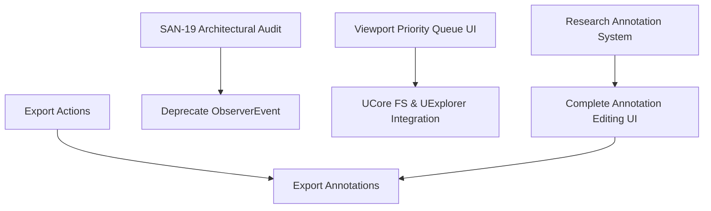

# Maintenance Tasks: UCore FS & UExplorer

**Last Updated**: 2025-12-28  
**Source**: Comprehensive research session

This document provides a prioritized list of maintenance tasks for UCore FS and UExplorer based on deep code analysis and roadmap review.

---

## Quick Reference

| Priority | UCore FS Tasks | UExplorer Tasks |
|----------|----------------|-----------------|
| **High** | 3 tasks | 3 tasks |
| **Medium** | 5 tasks | 4 tasks |
| **Low** | 4 tasks | 4 tasks |

---

## High Priority Tasks

### UCore FS

#### 1. [SAN-31] Remove Obsolete ChromaDB References ⏱️ 30 minutes
**Status**: Todo (marked high priority in roadmap)  
**Context**: ChromaDB replaced by FAISS, but old references remain in documentation

**Files to Update**:
- `src/ucorefs/README.md` - Remove ChromaDB mentions
- Search codebase for any lingering imports/comments

**Impact**: Documentation accuracy

#### 2. [SAN-19] USCore Architectural Audit & Refactor ⏱️ 1-2 weeks
**Status**: Todo (Foundation-level changes)  
**Tasks**:
- Deprecate `ObserverEvent` (sync) → Use `EventBus` (unified async)
- Fix ORM inheritance gaps in BaseRecord hierarchy
- Standardize logging configuration across all systems

**Impact**: Code maintainability, consistency

**Affected Systems**:
- All 18 UCore FS subsystems
- Foundation core modules

#### 3. Viewport Priority Queue UI Integration ⏱️ 2-3 hours
**Status**: Backend complete (SAN-14), UI integration deferred  
**Context**: Priority queue exists in ProcessingPipeline, but UI doesn't use it

**Implementation**:
```python
# In FilePaneWidget or FileBrowserDocument
def _on_viewport_changed(self):
    """Detect visible files when user scrolls"""
    visible_file_ids = self._get_visible_files_in_viewport()
    
    # Queue with HIGH priority
    for file_id in visible_file_ids:
        file = await FileRecord.get(file_id)
        if file.processing_state == ProcessingState.PHASE2_PENDING:
            await pipeline.enqueue_phase2([file_id], priority=0)  # HIGH
```

**Files to Modify**:
- UExplorer: `samples/uexplorer/uexplorer_src/ui/documents/file_browser_document.py`
- UExplorer: `samples/uexplorer/uexplorer_src/ui/main_window.py` (connect signal)

**Impact**: Significantly improves perceived performance for large collections

### UExplorer

#### 1. Add Export Actions ⏱️ 4-6 hours
**Status**: Missing (TODOs found in code)  
**User Impact**: High (users need to export data)

**Actions to Implement**:
1. **Export to ZIP**
   - Export selected files to archive
   - Preserve directory structure option
   - Named export (timestamp or custom name)

2. **Export Metadata to CSV/JSON**
   - Export FileRecord fields (path, tags, rating, etc.)
   - Configurable field selection
   - EXIF data export

3. **Export Search Results**
   - Export current search/filter results
   - Multiple formats (ZIP, CSV, JSON)

4. **Export Annotations** (if annotation system complete)
   - COCO format
   - YOLO format
   - Pascal VOC format

**Files to Modify**:
- `uexplorer_src/ui/actions/action_definitions.py` - Register actions
- `uexplorer_src/ui/main_window.py` - Add menu items
- Create `uexplorer_src/utils/export_utils.py` - Export logic

#### 2. Implement Batch Operations ⏱️ 4-8 hours
**Status**: Missing (TODOs found in code)  
**User Impact**: High (productivity feature)

**Operations to Implement**:
1. **Batch Tag Application**
   - Select multiple files → Apply tag to all
   - Tag picker dialog

2. **Batch Move to Folder**
   - Move selected files to target folder
   - Conflict resolution (skip, rename, overwrite)

3. **Batch Rename**
   - Pattern-based rename (e.g., `IMG_{counter:04d}`)
   - Preview before applying

4. **Batch Rating Change**
   - Set rating for all selected files

5. **Batch Delete**
   - Delete multiple files with confirmation

**Files to Modify**:
- `uexplorer_src/ui/actions/action_definitions.py` - Register batch actions
- `uexplorer_src/ui/dialogs/batch_operations_dialog.py` (NEW) - Batch UI
- `uexplorer_src/commands/batch_commands.py` (NEW) - Command implementations

#### 3. Viewport Priority Queue UI Integration ⏱️ 2-3 hours
**Same as UCore FS task #3** (cross-cutting concern)

---

## Medium Priority Tasks

### UCore FS

#### 4. [SAN-32] Update Legacy Documentation Paths ⏱️ 1-2 hours
**Status**: Backlog  
**Context**: Documentation has strict path references that don't match current `src/` structure

**Files to Update**:
- `docs/architecture.md`
- `docs/modules.md`
- `docs/tutorials.md`
- Search all `docs/*.md` for broken links

**Impact**: Documentation usability

#### 5. Research Annotation System ⏱️ 2-3 days
**Status**: Not started (mentioned in roadmap as "resarch anotation system")  
**Context**: `src/ucorefs/annotation/` exists but incomplete

**Deliverables**:
1. Requirements document
   - Use cases (manual annotation, AI annotation storage)
   - Annotation types (rectangle, polygon, polyline, point, keypoint)
   - Export formats needed (COCO, YOLO, Pascal VOC)

2. Model design
   ```python
   class Annotation(CollectionRecord):
       file_id: ObjectId
       annotation_type: str
       geometry: Dict  # {x, y, width, height} or {points: [...]}
       class_id: Optional[ObjectId]
       label: str
       confidence: float
       created_by: str  # User or AI model
   ```

3. Integration plan
   - How to integrate with DetectionService
   - UI requirements (drawing tools in ImageViewerDocument)

**Impact**: Enables annotation workflows (training data, object tagging)

#### 6. Research Reference System ⏱️ 1-2 days
**Status**: Not started (mentioned in roadmap as "resarch reference system")

**Use Cases**:
- Source material tracking (e.g., PSD → PNG derivatives)
- Citation tracking
- Dependency graphs
- Version chains (v1 → v2 → v3)

**Evaluation**:
- Can existing Relation system be extended?
- Or does it need a separate system?

**Deliverables**:
- Requirements document
- Model design (if separate system needed)
- Integration plan with existing systems

#### 7. Implement Checkpoint/Resume Pipeline State ⏱️ 4-6 hours
**Status**: Proposed (Roadmap Phase 5)  
**Problem**: Pipeline in-memory state (`_phase2_pending`, `_phase3_pending`) lost on crash

**Solution**:
1. Periodically serialize pending sets to MongoDB
   ```python
   class PipelineCheckpoint(CollectionRecord):
       phase2_pending: List[str]  # file_ids
       phase3_pending: List[str]
       last_checkpoint: datetime
   ```

2. On startup, restore pending sets
   ```python
   async def initialize(self):
       checkpoint = await PipelineCheckpoint.find_one()
       if checkpoint:
           self._phase2_pending = set(checkpoint.phase2_pending)
           self._phase3_pending = set(checkpoint.phase3_pending)
   ```

3. Add admin action "Clear Pipeline State"

**Files to Modify**:
- `src/ucorefs/processing/pipeline.py`
- `src/ucorefs/models/pipeline_checkpoint.py` (NEW)

**Impact**: Better crash recovery

#### 8. Implement Configuration Auto-Tuning ⏱️ 1-2 days
**Status**: Proposed (Roadmap Phase 5)  
**Context**: Manual config only; users don't know optimal settings

**Solution**:
1. System capability detection
   ```python
   def detect_system_capabilities():
       return {
           \"gpu\": detect_gpu(),  # CUDA, DirectML, CPU
           \"ram_gb\": psutil.virtual_memory().total // (1024**3),
           \"cpu_cores\": os.cpu_count(),
           \"disk_type\": \"SSD\" or \"HDD\"
       }
   ```

2. Tuning profiles
   - Low-end (4GB RAM, no GPU)
   - Medium (8GB RAM, integrated GPU)
   - High-end (16GB+ RAM, dedicated GPU)
   - Server (32GB+ RAM, multi-GPU)

3. Auto-adjust config
   ```python
   if ram_gb < 8:
       config.processing.phase2_batch_size = 10  # Lower batch
       config.processing.phase3_batch_size = 3
   ```

4. Config validation warnings
   - Warn if batch size too high for available RAM
   - Warn if GPU not detected but GPU config enabled

**Files to Modify**:
- `src/core/config.py` - Add auto-tuning logic
- `samples/uexplorer/uexplorer_src/ui/dialogs/settings_dialog.py` - Add "Auto-Tune" button

**Impact**: Better out-of-box performance

### UExplorer

#### 9. Complete Annotation Editing UI ⏱️ 1-2 days
**Status**: AnnotationPanel displays annotations (read-only)  
**Dependencies**: Requires UCore FS annotation system (task #5)

**Components Needed**:
1. **Drawing Tools** in ImageViewerDocument
   - Toolbar: Rectangle, Polygon, Polyline, Point tools
   - Mouse handlers (mousePress, mouseMove, mouseRelease)
   - Geometry rendering overlay

2. **Annotation Editor**
   - Class/label picker
   - Confidence slider (for AI annotations)
   - Save/discard buttons
   - Delete annotation

**Files to Modify**:
- `uexplorer_src/ui/documents/image_viewer_document.py` - Add drawing overlay
- `uexplorer_src/ui/docking/annotation_panel.py` - Add editing UI
- `uexplorer_src/ui/widgets/annotation_tools.py` (NEW) - Drawing tools

**Impact**: Enables annotation creation/editing workflows

#### 10. Implement Relation Editing ⏱️ 2-4 hours
**Status**: RelationsPanel displays relations (read-only)  
**TODOs Found**: "Implement relation editing", "Add Create Relation button"

**Features to Add**:
1. "Create Relation" button in RelationsPanel
2. CreateRelationDialog
   - Relation type picker (duplicate, similar, sequence, custom)
   - Target file picker (browse or search)
   - Create button

3. Delete relation action
   - Right-click → "Delete Relation"
   - Confirmation dialog

**Files to Modify**:
- `uexplorer_src/ui/docking/relations_panel.py` - Add button, context menu
- `uexplorer_src/ui/dialogs/create_relation_dialog.py` (NEW)

**Impact**: Manual relation management

#### 11. Add Tab Persistence ⏱️ 2-3 hours
**Status**: TODOs found in DocumentManager  
**Context**: Open documents not saved on app close

**Implementation**:
1. Save document state to config
   ```json
   {
     "open_documents": [
       {"type": "file_browser", "directory_id": "abc123"},
       {"type": "image_viewer", "file_id": "def456"}
     ]
   }
   ```

2. Restore on app start
   ```python
   def restore_session(self):
       for doc_state in config.get(\"open_documents\", []):
           if doc_state[\"type\"] == \"file_browser\":
               self.open_file_browser(doc_state[\"directory_id\"])
   ```

3. Add MRU (Most Recently Used) list
   - File → Recent Documents submenu
   - Track last 10 opened files/directories

**Files to Modify**:
- `uexplorer_src/viewmodels/document_manager.py` - Save/restore logic
- `uexplorer_src/ui/main_window.py` - Restore on startup
- `config.json` - Store session state

**Impact**: Convenience (user doesn't lose workspace layout)

#### 12. Integrate ThemeManager ⏱️ 1-2 hours
**Status**: Foundation feature not integrated  
**Context**: UExplorer uses default Qt styles only

**Implementation**:
1. Register ThemeManager in bootstrap
2. Add theme picker to SettingsDialog
3. Apply theme on selection
   ```python
   theme_manager = locator.get_service(ThemeManager)
   theme_manager.set_theme(\"dark\")
   ```

**Files to Modify**:
- `samples/uexplorer/main.py` - Register ThemeManager
- `uexplorer_src/ui/dialogs/settings_dialog.py` - Add theme picker

**Impact**: Visual customization

---

## Low Priority Tasks

### UCore FS

#### 13. Implement [SAN-13] System Bundles ⏱️ 4-6 hours
**Status**: Deferred (roadmap unsorted section)  
**Problem**: `main.py` has verbose service registration (10+ lines)

**Solution**:
```python
class SystemBundle:
    def register(self, builder: ApplicationBuilder):
        pass

class UCoreFSBundle(SystemBundle):
    def register(self, builder):
        builder.register_system(FSService)
        builder.register_system(DiscoveryService)
        builder.register_system(ProcessingPipeline)
        # ... all UCoreFS systems

# Usage in main.py
app.register_bundle(UCoreFSBundle())
```

**Files to Create**:
- `src/core/bundles.py` - SystemBundle base class
- `src/ucorefs/bundle.py` - UCoreFSBundle

**Impact**: Code organization, cleaner main.py

#### 14. Add [SAN-8] Loading Dialog ⏱️ 2-3 hours
**Status**: Todo (roadmap unsorted section)

**Requirements**:
- Modal loading indicator for long-running operations
- Indeterminate progress (spinner)
- Determinate progress (progress bar with percentage)
- Expose via DialogService

**Files to Create**:
- `src/ui/dialogs/loading_dialog.py`

**Integration**:
```python
dialog_service.show_loading(\"Processing files...\")
# ... long operation ...
dialog_service.hide_loading()
```

**Impact**: Better UX for long operations

#### 15. Implement [SAN-23] Docking Auto-Hide ⏱️ 4-6 hours
**Status**: Todo (roadmap Phase 3)  
**Requirement**: "Unpin" functionality for dock panels (like VS Code)

**Features**:
- Pin/unpin button on panels
- Auto-hide when unpinned (slides out on hover)
- Persist pin state

**Files to Modify**:
- DockManager or BasePanelWidget

**Impact**: More screen space for content

#### 16. Implement Search Query Optimization ⏱️ 2-3 days
**Status**: Proposed (Roadmap Phase 5)  
**Goal**: Reduce search latency for large collections (1M+ files)

**Optimizations**:
1. Query result caching with TTL
2. MongoDB query plan analysis and index optimization
3. Vector search pre-filtering using aggregation pipelines
4. Hybrid search scoring algorithm tuning
5. Query profiling and metrics

**Files to Modify**:
- `src/ucorefs/search/service.py`
- `src/ucorefs/query/builder.py`

**Impact**: Faster search in large collections

### UExplorer

#### 17. Add Infinite Scroll / Pagination ⏱️ 4-6 hours
**Status**: TODOs found in FileBrowserDocument  
**Context**: Currently loads all files in directory (slow for 10,000+ files)

**Implementation**:
1. Virtual scrolling (only render visible items)
2. Lazy loading (load files as user scrolls)
3. Pagination controls (if virtual scrolling not sufficient)

**Files to Modify**:
- `uexplorer_src/ui/documents/file_browser_document.py`

**Impact**: Better performance for very large directories

#### 18. Integrate PluginManager ⏱️ 1-2 days
**Status**: Foundation feature not integrated  
**Use Cases**:
- Custom extractors
- Custom file drivers
- Custom actions
- Custom panels

**Implementation**:
1. Register PluginManager in bootstrap
2. Define plugin interface
3. Add plugin loader
4. Add plugin settings UI

**Impact**: Extensibility for advanced users

#### 19. Integrate UpdateService ⏱️ 1 day
**Status**: Foundation feature not integrated  
**Features**:
- Check for updates on startup
- Download and install updates
- Update notifications

**Impact**: Easier distribution updates

#### 20. Integrate TelemetryService ⏱️ 1-2 days
**Status**: Foundation feature not integrated  
**Features**:
- Usage analytics (anonymized)
- Crash reporting
- Feature usage tracking

**Impact**: Product insights (opt-in only)

---

## Task Dependencies



**Critical Path**:
1. Research annotation system → Complete annotation editing → Export annotations
2. SAN-19 audit → Deprecate ObserverEvent
3. Viewport priority queue UI integration (high impact, no dependencies)

---

## Effort Estimates Summary

| Priority | Total Effort (UCore FS) | Total Effort (UExplorer) |
|----------|-------------------------|--------------------------|
| **High** | 1-2 weeks | 10-17 hours |
| **Medium** | 7-13 days | 5-10 days |
| **Low** | 10-17 days | 6-9 days |

**Grand Total**: ~6-9 weeks of work (1 developer)

---

## Recommended Execution Order

### Sprint 1: Quick Wins (High Priority)
1. ✅ Complete research documentation (DONE)
2. [SAN-31] Remove ChromaDB references (30 min)
3. Viewport priority queue UI integration (2-3 hours)
4. Export actions (4-6 hours)

**Duration**: 1 week  
**Impact**: High user-facing improvements

### Sprint 2: Productivity Features
5. Batch operations (4-8 hours)
6. [SAN-32] Update legacy docs (1-2 hours)
7. Relation editing (2-4 hours)
8. Tab persistence (2-3 hours)

**Duration**: 1 week  
**Impact**: User productivity

### Sprint 3: Foundation Improvements
9. [SAN-19] Architectural audit (1-2 weeks)
10. Research annotation system (2-3 days)
11. Research reference system (1-2 days)

**Duration**: 2-3 weeks  
**Impact**: Code quality, future features

### Sprint 4: Advanced Features
12. Complete annotation editing (1-2 days)
13. Configuration auto-tuning (1-2 days)
14. Checkpoint/resume pipeline (4-6 hours)

**Duration**: 1 week  
**Impact**: Advanced workflows

---

## References

- [UCore FS Comprehensive Analysis](file:///d:/github/USCore/docs/ucorefs_comprehensive_analysis.md)
- [UExplorer Comprehensive Analysis](file:///d:/github/USCore/docs/uexplorer_comprehensive_analysis.md)
- [Roadmap](file:///d:/github/USCore/docs/roadmap.md)
- [Session Journal](file:///d:/github/USCore/dev_log/journal_session_ucorefs_uexplorer_research.md)
