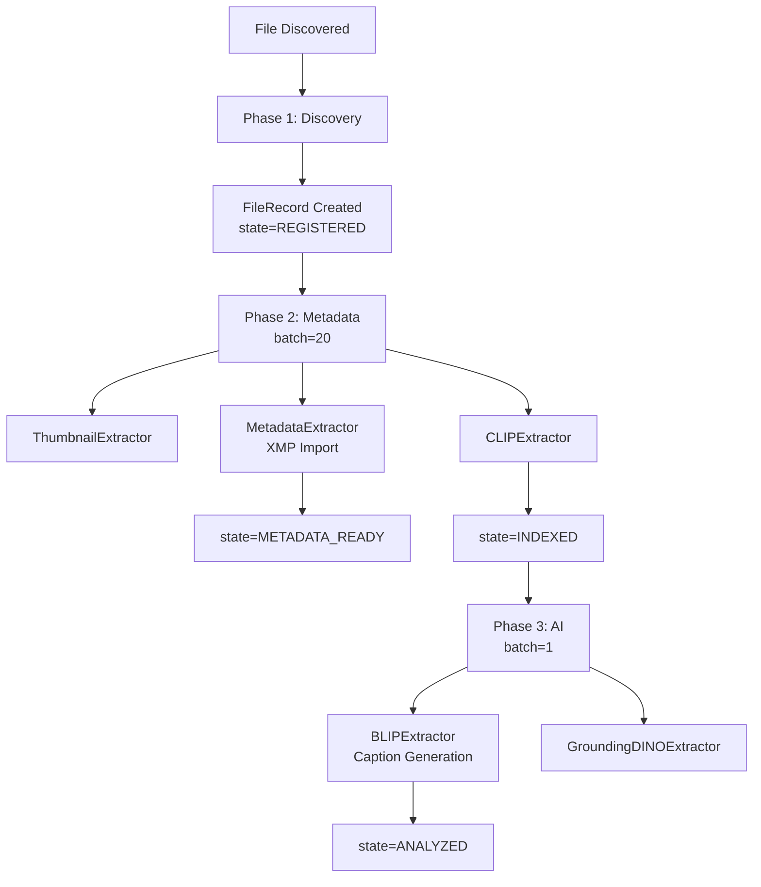

# Research Summary: Metadata and BLIP Integration System

**Date**: 2025-12-28  
**Research Phase**: Complete  
**Status**: Awaiting User Review

---

## Executive Summary

Completed comprehensive research of UCoreFS metadata extraction and BLIP integration system. Current implementation has solid foundation with separate fields for user metadata (`description`) and AI-generated content (`ai_caption`). XMP extractor already supports hierarchical tags and metadata import. Key enhancements needed:

1. **BLIP Auto-Description**: Add config option to populate `description` from BLIP caption if empty
2. **Metadata Field Protection**: Prevent XMP from overwriting user-entered data
3. **Non-English Path Support**: Add fallback for pyexiv2 path handling issues
4. **GUI Enhancements**: Show AI captions and expose pipeline controls in UExplorer

---

## System Architecture

### FileRecord Schema

```python
class FileRecord(FSRecord):
    # User Metadata (from XMP or manual)
    rating: int = 0-5            # Star rating
    label: str = ""              # Color label
    description: str = ""        # User/XMP description
    
    # AI Metadata (generated)
    ai_caption: str = ""         # BLIP caption
    ai_description: str = ""     # Future use
    
    # Tags & Organization
    tag_ids: List[ObjectId]      # References to Tag collection
    tags: List[str]              # Denormalized for display
    album_ids: List[ObjectId]    # Album memberships
    
    # Processing
    processing_state: int        # 0-100 state machine
    embeddings: Dict             # CLIP, BLIP vectors
    detections: Dict             # YOLO, Face results
```

**Design Decision**: Separate `description` (user) from `ai_caption` (AI) provides transparency and flexibility.

---

### Indexer Pipeline Flow



**Key Points**:
- Phase 2 (fast): XMP metadata extraction, basic embeddings
- Phase 3 (slow): AI caption generation, object detection
- Processing state advances through defined stages
- All processing done via TaskSystem (crash-resistant, persistent)

---

### Current XMP Metadata Extraction

**What Works Well**:
- ✅ Hierarchical tag parsing with separators `/`, `|`, `\`
- ✅ Multiple XMP format support (Lightroom, digiKam, Photoshop)
- ✅ Label and description extraction
- ✅ Rating import from `Xmp.xmp.Rating`
- ✅ Tag synonym resolution via RulesEngine

**Issues Found**:
- ⚠️ Overwrites existing FileRecord data on every extraction
- ⚠️ May fail on non-English file paths (pyexiv2 limitation)
- ⚠️ No visual indicator in GUI showing data source (XMP vs. user-entered)

**Example XMP Data**:
```xml
<x:xmpmeta>
  <rdf:Description>
    <xmp:Label>Blue</xmp:Label>
    <xmp:Rating>4</xmp:Rating>
    <dc:subject>
      <rdf:Bag>
        <rdf:li>Animals/Mammals/Cats</rdf:li>
        <rdf:li>Colors|Blue</rdf:li>
      </rdf:Bag>
    </dc:subject>
    <dc:description>
      <rdf:Alt>
        <rdf:li xml:lang="x-default">Cute cat photo</rdf:li>
      </rdf:Alt>
    </dc:description>
  </rdf:Description>
</x:xmpmeta>
```

**Resulting Tags**:
- `Animals`
- `Animals/Mammals`
- `Animals/Mammals/Cats`
- `Colors`
- `Colors|Blue`

---

### Current BLIP Integration

**Model**: Salesforce/blip-image-captioning-base  
**Phase**: 3 (batch size: 1)  
**Priority**: 80  
**Device**: CUDA if available, else CPU

**Current Flow**:
```python
# BLIPExtractor.extract()
image = Image.open(file.path).convert("RGB")
inputs = processor(image, return_tensors="pt").to(device)
output = model.generate(**inputs, max_length=50)
caption = processor.decode(output[0], skip_special_tokens=True)

# BLIPExtractor.store()
file.ai_caption = caption  # ← Only field updated
file.processing_state = ProcessingState.ANALYZED
await file.save()
```

**What's Missing**:
- No option to populate `description` field
- No GUI display of `ai_caption`
- No manual trigger for caption generation
- No batch processing for multiple files

---

### UExplorer GUI Status

**Metadata Panel** (`metadata_panel.py`):

**Currently Shows**:
- Preview thumbnail
- Rating (5-star widget, editable)
- Tags (TagSelector, editable with autocomplete)
- Description (QTextEdit, editable)
- Processing state (color-coded: Registered → Indexed → Analyzed)
- Embeddings status (CLIP, DINO available)
- Detections count (objects/faces found)

**Missing**:
- AI-generated caption display
- "Generate Description" button
- Indicator when description is AI-sourced
- Extractor-specific status (which extractors ran)

**Maintenance Panel** (`maintenance_panel.py`):
- Shows scheduled tasks (background verification, DB optimization)
- **Missing**: Manual Phase 2/3 reprocessing controls

---

## Proposed Enhancements

### 1. Configurable BLIP Auto-Description

**Config Option**:
```json
{
  "metadata": {
    "auto_fill_description_from_blip": false
  }
}
```

**Behavior**:
- `false` (default): Only populate `ai_caption`
- `true`: Also copy to `description` if empty

**Rationale**: Gives users control while maintaining data integrity

---

### 2. Metadata Field Protection

**Current Issue**:
```python
# MetadataExtractor.store() - ALWAYS overwrites
file.label = xmp_data.get("label", "")
file.description = xmp_data.get("description", "")
file.rating = xmp_data.get("rating", 0)
```

**Proposed Fix**:
```python
# Only fill if currently empty
if not file.label and xmp_data.get("label"):
    file.label = xmp_data["label"]
    
if not file.description and xmp_data.get("description"):
    file.description = xmp_data["description"]
    
if file.rating == 0 and xmp_data.get("rating"):
    file.rating = xmp_data["rating"]
```

**Benefit**: Prevents stale XMP from overwriting user edits

---

### 3. Non-English Path Support

**Problem**:
```python
# Fails on paths like: D:\Фото\猫\image.jpg
img = pyexiv2.Image("D:\\Фото\\猫\\image.jpg")
# UnicodeDecodeError or OSError
```

**Solution**:
```python
try:
    img = pyexiv2.Image(file_path)
    xmp_data = img.read_xmp()
    img.close()
except (UnicodeDecodeError, OSError):
    # Fallback: read file to bytes
    with open(file_path, 'rb') as f:
        data = f.read()
    img = pyexiv2.ImageData(data)  # Use in-memory API
    xmp_data = img.read_xmp()
    img.close()
```

**Tradeoff**: Slight memory overhead for robustness

---

### 4. GUI Enhancements

**Metadata Panel Additions**:
```python
# New section: AI-Generated Content
group = QGroupBox("AI-Generated")
self.ai_caption_label = QLabel()
self.ai_caption_label.setWordWrap(True)
self.ai_caption_label.setStyleSheet("font-style: italic; color: #9a8a5a;")

btn_generate = QPushButton("Generate Description")
btn_generate.clicked.connect(self._trigger_blip)
```

**Maintenance Panel Additions**:
- "Reprocess Metadata (Phase 2)" button
- "Reprocess AI (Phase 3)" button
- Per-extractor status grid

---

## Impact Analysis

### Systems Affected

| System | Impact | Risk | Mitigation |
|--------|--------|------|------------|
| MetadataExtractor | Modified store logic | Low | Only changes when fields empty |
| BLIPExtractor | Add config check | Low | Opt-in feature |
| XMPExtractor | Add fallback path | Low | Only used on error |
| MetadataPanel | New UI sections | Medium | Incremental addition |
| Config Schema | New section | Low | Defaults provided |

### Performance Considerations

1. **In-Memory File Reading**:
   - Only triggers on path access failure
   - ~10-50MB overhead for RAW files
   - Acceptable for rare edge cases

2. **BLIP Processing**:
   - Already in Phase 3 (low priority)
   - One file at a time
   - No additional overhead

3. **Metadata Checking**:
   - Minimal overhead (3 if-checks)
   - No database queries added
   - Negligible impact

---

## Recommendations

### High Priority
1. ✅ Implement metadata field protection (prevents data loss)
2. ✅ Add non-English path support (critical for international users)
3. ✅ Display AI captions in GUI (improves usability)

### Medium Priority
4. ⚠️ Add BLIP auto-fill config option (user preference)
5. ⚠️ Add manual caption generation button (power user feature)

### Low Priority (Future)
6. 🔵 Bulk description generation (performance-intensive)
7. 🔵 Multi-language BLIP models (requires research)
8. 🔵 XMP write-back (save edits to files)
9. 🔵 Tag hierarchy visualization (tree view)

---

## Open Questions for User

> [!IMPORTANT]
> **Decision Required: BLIP Auto-Fill Behavior**
> 
> How should BLIP captions populate the `description` field?
> 
> **Option A** (Recommended): 
> - Keep `ai_caption` separate
> - Show both in GUI
> - User decides which to keep
> 
> **Option B**:
> - Auto-fill `description` if empty
> - Configurable via settings
> - May confuse users (AI vs user content)
> 
> **Option C**:
> - Never auto-fill description
> - Only use `ai_caption` field
> - User must manually copy if desired

> [!WARNING]
> **Tag Proliferation**
> 
> Hierarchical tags create intermediate entries:
> - `Animals` → `Animals/Mammals` → `Animals/Mammals/Cats`
> 
> Deep hierarchies (5+ levels) may create many tags. Is this acceptable, or should we:
> - Only create leaf tags?
> - Add tag merge utility?
> - Limit hierarchy depth?

---

## Next Steps

1. **User Review**: Review `implementation_plan.md` and `task.md`
2. **Decision**: Choose BLIP auto-fill behavior (Option A/B/C)
3. **Approval**: Greenlight implementation phases
4. **Implementation**: Begin Phase 1 (metadata field protection)

---

## References

- [FileRecord Schema](file:///D:/github/USCore/src/ucorefs/models/file_record.py)
- [MetadataExtractor](file:///D:/github/USCore/src/ucorefs/extractors/metadata.py)
- [BLIPExtractor](file:///D:/github/USCore/src/ucorefs/extractors/blip_extractor.py)
- [XMP Extractor](file:///D:/github/USCore/src/ucorefs/extractors/xmp.py)
- [Processing Pipeline](file:///D:/github/USCore/src/ucorefs/processing/pipeline.py)
- [Metadata Panel](file:///D:/github/USCore/samples/uexplorer/uexplorer_src/ui/widgets/metadata_panel.py)
- [Previous Pipeline Research](file:///D:/github/USCore/dev_log/journal_session_indexer_pipeline_research.md)

