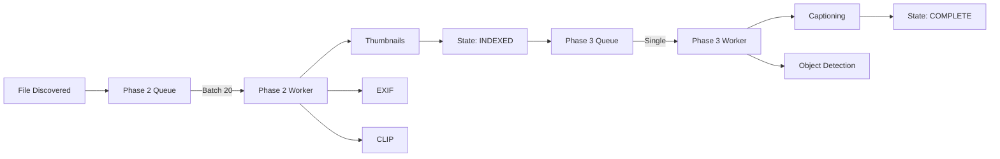

# Processing Pipeline

The `ProcessingPipeline` (`src.ucorefs.processing.pipeline`) is the core engine for enriching files with metadata and AI insights. It operates in phases to balance load and prioritize immediate user needs.

## Phased Approach

### Phase 1: Discovery
-   **Service**: `ScanningService`
-   **Action**: Walks directories, detects file changes.
-   **Output**: Creates `DISCOVERED` state records. Fast, minimal I/O.

### Phase 2: Indexing (Batch Processing)
-   **Service**: `ProcessingPipeline` (`enqueue_phase2`)
-   **Batch Size**: 20 items.
-   **Triggers**: New file discovery, file modification.
-   **Handlers**:
    -   **Thumbnails**: Generates preview images.
    -   **Metadata**: Extracts EXIF, XMP, modification dates.
    -   **CLIP Embeddings**: Generates vector embedding from image content.
-   **State**: file moves to `INDEXED`.

### Phase 3: AI Enrichment (Single Item)
-   **Service**: `ProcessingPipeline` (`enqueue_phase3`)
-   **Batch Size**: 1 item (CPU/GPU Heavy).
-   **Triggers**: Completion of Phase 2.
-   **Handlers**:
    -   **BLIP**: Generates text descriptions/captions.
    -   **Detection**: Runs Object Detection (YOLO, GroundingDINO).
    -   **Face Recognition**: Detects faces (MTCNN).
-   **State**: file moves to `COMPLETE`.

## Architecture

## AI Thread Pool

To prevent blocking the core application loop, CPU-intensive AI tasks (like running PyTorch models) are offloaded to a dedicated `ThreadPoolExecutor` (named `ai-cpu`).
-   **Workers**: Configurable (default: 8).
-   **Isolation**: Ensures AI inference doesn't starve I/O or UI tasks.
