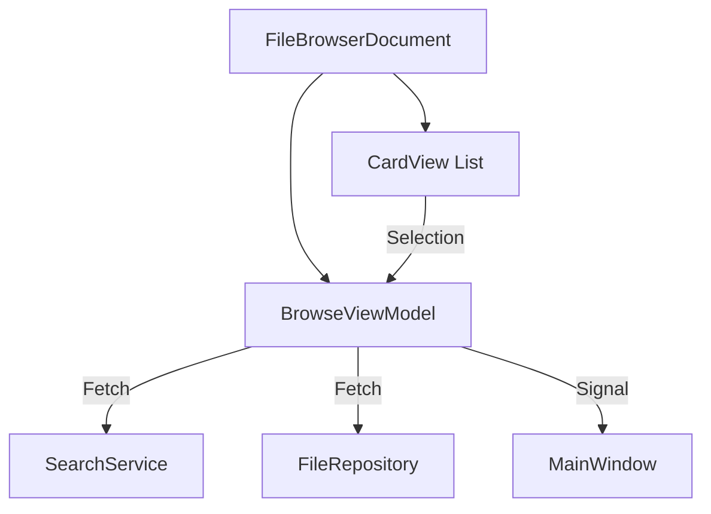

# Feature: File Browser

The File Browser is the central component of UExplorer, implementing the `FileBrowserDocument` class.

## Capabilities

-   **Card View**: Responsive grid of `FileCardWidget` items.
    -   Displays thumbnails (lazy loaded).
    -   Shows metadata badges (rating, file type).
    -   Hover effects for quick actions.
-   **Navigation**: Breadcrumb bar for directory hierarchy navigation.
-   **Selection**: Multi-select support (Ctrl/Shift + Click).
-   **Drag & Drop**:
    -   Drag files to Album tree to add to album.
    -   Drag files to Tag tree to tag.

## Architecture

## Usage

1.  **Open**: Double-click a folder in the Directory Tree.
2.  **Navigate**: Click breadcrumbs or use `Alt + Left/Right`.
3.  **Sort**: Use the sort dropdown in the toolbar.
