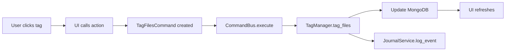
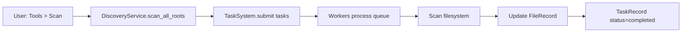

# UExplorer Architecture Documentation

## Overview

UExplorer is a professional file manager demonstrating **73% of Foundation template features**. This document explains how Foundation patterns are implemented.

---

## System Architecture

### ServiceLocator Pattern

All services are registered via `ApplicationBuilder` in `main.py`:

```python
builder = ApplicationBuilder("UExplorer", "config.json")
builder.with_default_systems()  # Foundation systems

# UCoreFS systems
builder.add_system(FSService)
builder.add_system(DiscoveryService)
builder.add_system(TagManager)
builder.add_system(AlbumManager)
# ... 10 more systems

locator = await builder.build()
```

**Benefits**:
- Dependency injection
- Easy testing (mock services)
- Centralized lifecycle management

---

## GUI Architecture

### 1. ActionRegistry (Centralized Actions)

All UI actions defined in `src/ui/actions/action_definitions.py`:

**Benefits**:
- Single source of truth
- Automatic Command Palette integration
- Consistent shortcuts across app

### 2. Command Palette

Fuzzy search interface for all actions (`Ctrl+Shift+P`):

- Searches action names and shortcuts
- Keyboard navigation
- Instant command execution

### 3. DockManager + BasePanelWidget

All 4 panels extend `BasePanelWidget`:

```python
class TagPanel(BasePanelWidget):
    def initialize_ui(self):
        """Build UI when panel first shown"""
        
    def on_update(self, context=None):
        """Refresh content"""
        
    def get_state(self) -> dict:
        """Save panel state"""
        
    def set_state(self, state: dict):
        """Restore from saved state"""
```

**Panels**:
- Tags (`Ctrl+1`)
- Albums (`Ctrl+2`)
- Relations (`Ctrl+3`)
- Properties (`Ctrl+4`)

**State Persistence**: Panel sizes and positions saved to `layout.json`

---

## Command Pattern (CommandBus)

File operations implemented as commands in `src/commands/file_commands.py`:

```python
class TagFilesCommand:
    def __init__(self, locator, file_ids, tag_id):
        self.locator = locator
        self.file_ids = file_ids
        self.tag_id = tag_id
    
    async def execute(self) -> dict:
        # Execute operation
        # Log to JournalService
        return {'success': True}
```

**Commands**:
- `TagFilesCommand` - Tag multiple files
- `UntagFilesCommand` - Remove tags
- `DeleteFilesCommand` - Delete with undo (demo)

**Benefits**:
- Testable business logic
- Audit logging integration
- Potential undo/redo support

---

## Background Tasks (TaskSystem)

Async task processing via `TaskSystem`:

- **Task Storage**: MongoDB (`TaskRecord` collection)
- **Workers**: 3 async workers process queue
- **Crash Recovery**: Interrupted tasks auto-requeued

Example task in `src/tasks/scan_task.py`:

```python
async def scan_directory_task(locator, params):
    discovery = locator.get_system(DiscoveryService)
    result = await discovery.scan_directory(params['path'])
    return result
```

**Integration**: DiscoveryService registers scan handler with TaskSystem

---

## Audit Logging (JournalService)

All file operations logged to `journal_events` collection:

```python
# In TagFilesCommand.execute()
journal = self.locator.get_system(JournalService)
await journal.log_event("file_operation", {
    "action": "tag_files",
    "file_count": 5,
    "tag_id": "landscape",
    "status": "success"
})
```

**Utility Helper** (`src/utils/audit.py`):
```python
from src.utils.audit import log_file_operation

await log_file_operation(
    locator, "tag_files",
    file_ids=[...],
    success=True,
    tag_id="nature"
)
```

**Use Cases**:
- Compliance auditing
- User activity tracking
- Debugging operations
- Analytics

---

## Data Flow

### File Tagging Operation



### Directory Scanning



---

## File Organization

```
src/
├── commands/               # CommandBus pattern
│   ├── __init__.py
│   └── file_commands.py   # Tag/Untag/Delete commands
│
├── tasks/                  # Background tasks
│   ├── __init__.py
│   └── scan_task.py       # Directory scanning
│
├── ui/
│   ├── actions/           # ActionRegistry
│   │   ├── __init__.py
│   │   └── action_definitions.py  # 18 actions
│   │
│   ├── docking/           # BasePanelWidget panels
│   │   ├── tag_panel.py
│   │   ├── album_panel.py
│   │   ├── relations_panel.py
│   │   └── properties_panel.py
│   │
│   ├── widgets/           # Reusable components
│   └── main_window.py     # Window + ActionRegistry
│
├── ucorefs/               # UCoreFS services (14 systems)
│
└── utils/                 # Helpers
    └── audit.py          # JournalService helpers
```

---

## Configuration

### config.json

```json
{
  "ui": {
    "window_width": 1400,
    "window_height": 900,
    "theme": "dark"
  },
  "mongo": {
    "host": "localhost",
    "port": 27017,
    "database": "foundation_app"
  }
}
```

### layout.json (auto-generated)

Persists panel states and window layout.

---

## Testing

### Unit Tests

```bash
pytest tests/test_action_registry.py  # Action system
pytest tests/test_commands.py         # Command execution
pytest tests/test_task_system.py      # Background tasks
```

### Manual Testing

1. **Command Palette**: Press `Ctrl+Shift+P`, search for actions
2. **Background Tasks**: Tools → Scan, watch status bar
3. **Audit Logs**: Check MongoDB `journal_events` collection
4. **State Persistence**: Resize panels, restart, verify restoration

---

## Extension Points

### Adding New Actions

1. Add to `src/ui/actions/action_definitions.py`:
```python
registry.register_action(
    "custom.action",
    "My Action",
    callback_function,
    shortcut="Ctrl+M"
)
```

2. Automatically appears in:
   - Menus
   - Command Palette
   - Shortcuts dialog

### Adding New Commands

1. Create in `src/commands/`:
```python
class MyCommand:
    async def execute(self):
        # Business logic
        # Audit logging
        return result
```

2. Execute via:
```python
bus = locator.get_system(CommandBus)
await bus.execute(MyCommand(...))
```

### Adding New Panels

1. Extend `BasePanelWidget`
2. Implement `initialize_ui()`, `get_state()`, `set_state()`
3. Register with `DockManager`

---

## Performance Considerations

- **Async I/O**: All database operations use `async/await`
- **Lazy Loading**: File tree virtualizes large directories
- **Background Processing**: Heavy operations use TaskSystem
- **Caching**: FileModel caches folder contents

---

## Best Practices Demonstrated

✅ **Separation of Concerns**: UI, Business Logic, Data separate  
✅ **Dependency Injection**: ServiceLocator pattern  
✅ **Command Pattern**: Decoupled operations  
✅ **Observer Pattern**: Signals for UI updates  
✅ **Repository Pattern**: Services abstract data access  
✅ **Factory Pattern**: ApplicationBuilder  
✅ **Strategy Pattern**: TaskSystem handlers  

---

## Foundation Coverage

**14/19 features** (73%):
- ✅ ServiceLocator, ApplicationBuilder, ConfigManager
- ✅ DatabaseManager, Async ORM, BaseSystem
- ✅ TaskSystem, CommandBus, JournalService
- ✅ DockManager, BasePanelWidget, ActionRegistry
- ✅ MenuBuilder, Command Palette

**Future Enhancements**:
- ViewModelProvider formalization
- AssetManager for themes/icons
- Settings Dialog showcase

---

**See Also**:
- Foundation Template: `templates/foundation/`
- UCoreFS Documentation: `src/ucorefs/README.md`
- API Reference: `docs/api/` (if available)
